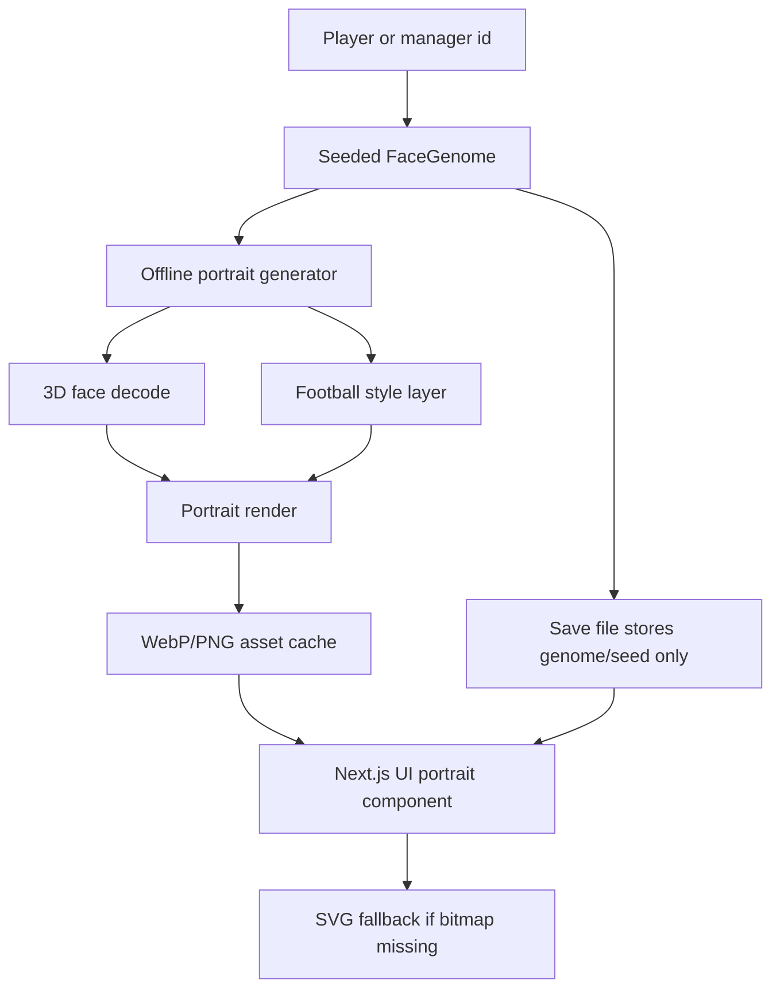

# Face Model Research And Implementation Plan

## Recommendation

Use a FaceVerse-inspired offline portrait-generation pipeline as the foundation, not a full in-browser 3D runtime.

For Football Director Pro, the product requirement is not real-time face fitting. It is deterministic, scalable, good-looking player and manager identity for thousands of fictional people across long careers. The right architecture is:

1. Store only a small deterministic `FaceGenome` for each person.
2. Generate portrait images from that genome in an offline/build-time or local-cache pipeline.
3. Ship the game with lightweight WebP/PNG portrait assets or generate them into IndexedDB cache.
4. Keep the existing SVG `PersonAvatar` as fallback and as the first implementation target until the render pipeline is proven.

FaceVerse is the best conceptual foundation because it explicitly separates identity, expression, texture/albedo, lighting, camera, and render coefficients. That maps cleanly to our need for repeatable identities, mature face lighting, and large variation. The FaceVerse repository is BSD-2-Clause for code, but the model/checkpoint/data terms still need legal review before any commercial asset pipeline ships. If model rights are not acceptable, we should still reuse the architecture pattern, not the assets.

## Product Requirements

- Faces must stay consistent for the same player or manager across saves, screens, and seasons.
- The system must generate many unique fictional people without manual art creation.
- Portraits should feel closer to mature football editorial / illustrated player cards, not childlike avatars.
- The runtime app must remain fast on mobile web and Capacitor.
- Save files should not store bitmap blobs.
- The system must support future age progression, manager styling, kits, hair, facial hair, injuries/scars, and form/legacy presentation.
- No third-party avatar API should be required at runtime.

## Comparison

| Project | Strength | Weakness | Fit for our game |
| --- | --- | --- | --- |
| `nano_bfm` | Very small Basel Face Model generator; simple shape + texture coefficient idea; claims 4-5 ms mesh generation on author's machine. | Windows/CUDA/cuBLAS-oriented; old Basel dependency; thin repo; not enough high-level portrait pipeline, hair, style, or mobile packaging story. | Useful as a minimal reference for coefficient-to-mesh math, not as our foundation. |
| `eos` | Mature C++ 3DMM library; clear `MorphableModel` and `PcaModel` abstractions; supports SFM, BFM, 4DFM, LYHM; has fitting, texture extraction, Python bindings. | Geared toward fitting/reconstruction from landmarks/images, not seeded fictional portrait generation; bundled SFM model has non-commercial limitation; C++ runtime is wrong for our current web stack. | Best engineering reference for clean 3DMM class boundaries, but not the product foundation. |
| `face3d` | Readable Python/Numpy educational pipeline; generates 3D faces from morphable models; includes mesh transform, camera, light, render, UV/image maps. | Older research/learning project; BFM data prep needed; no explicit commercial-ready model/package; less polished output and less modern than FaceVerse/FLAME. | Good prototype aid for understanding math and building a simple batch renderer. |
| `FLAME` | Strong expressive head model; identity shape, jaw, neck, eyes, pose-corrective blendshapes, expressions; learned from large scan corpus. | Model download requires signup/license acceptance; geometry-first, not a full texture/hair/portrait style system; PyTorch runtime is too heavy for app runtime. | Strong fallback if we want controllable 3D head geometry, but it needs a separate texture/style/hair layer. |
| `FaceVerse` | Best match for portrait quality architecture: identity, expression, texture/albedo, lighting, camera, differentiable rendering, coarse-to-fine detail model; includes simplified model path and later v4 parameter predictor. | Heavy Python/PyTorch/PyTorch3D/CUDA/Jittor ecosystem; detailed refinement can be slow; dataset/model/checkpoint rights need legal validation; dataset is East Asian-heavy, so we need diversity calibration. | Best foundation for our offline generator architecture, with our own football/style layer and deterministic sampling. |

## Why FaceVerse Wins

FaceVerse has the right separation of concerns for game identity:

- `id_coeff`: long-term facial identity.
- `exp_coeff`: expression/personality pose.
- `tex_coeff`: albedo/skin tone/color.
- `angles`, `gamma`, `translation`: camera, lighting, and render presentation.
- Simplification paths for lower vertex count rendering.

That means one footballer can keep the same identity while the UI changes crop, lighting, kit, expression, age lines, or manager/player clothing. This is exactly what we need for a chairman game where players become long-term memories.

FLAME is cleaner and more widely used for head geometry, but it does not solve texture/style as directly. `eos` and `face3d` are better as implementation references. `nano_bfm` is too narrow and too CUDA/Windows-specific for our product.

## What To Reuse

Reuse conceptually:

- FaceVerse-style coefficient groups: identity, expression, texture, lighting, pose/camera.
- Batch-generation pipeline: generate many faces from parameter vectors, render to image, save manifest.
- Simplified model path: lower vertex/detail settings for large batches.
- Renderer separation: model decode and portrait render should be independent modules.
- Deterministic coefficient sampling from seed.

Reuse directly only after license review:

- BSD-licensed code patterns and helper logic if compatible.
- Model/checkpoints only if the license and redistribution/commercial terms are confirmed.

Do not reuse:

- FaceVerse demo UI/copy.
- Dataset faces or any example identity as a game character.
- Runtime PyTorch/PyTorch3D/Jittor inside the Next.js/Capacitor app.

## Proposed Architecture



### `FaceGenome`

Add a future data model separate from player ability:

```ts
type FaceGenome = {
  version: 1;
  seed: string;
  archetype: "academy" | "starter" | "veteran" | "manager";
  identity: number[];
  expression: number[];
  texture: number[];
  lighting: {
    key: "left" | "front" | "right";
    contrast: number;
    warmth: number;
  };
  camera: {
    yaw: number;
    pitch: number;
    roll: number;
    crop: "thumb" | "card" | "hero";
  };
  style: {
    hair: string;
    facialHair: string;
    kitPalette: string;
    background: string;
    ageLines: number;
  };
};
```

In V1.1 we can derive this from `person.id` without migrating every save immediately. Later, if we want editable or aging faces, store `faceGenome` on `Player` and `Manager`.

## Implementation Plan

### Phase 1 - Face Genome And SVG Upgrade

Keep this inside the current app.

- Create `src/game/portraits.ts` with deterministic `createFaceGenome(person)` and `faceGenomeFromSeed(seed)`.
- Refactor `PersonAvatar` so it reads a `FaceGenome` object rather than many local `avatarPick` calls.
- Remove exact trust/impact language from any remaining player-facing decision copy while preserving engine state changes.
- Add tests that the same player id produces the same genome and different ids produce sufficiently different genomes.
- Keep output as local SVG for now.

### Phase 2 - Offline Renderer Prototype

Prototype outside the app, probably under `tools/portrait-renderer/`.

- Build a Python batch script that accepts a JSON list of `FaceGenome` records.
- First implementation target: static 256x384 portrait cards.
- Render 20-50 sample players and managers.
- Compare visually against the two supplied references.
- Validate asset size, generation time, and mobile display quality.

### Phase 3 - FaceVerse/FLAME Spike

Run two spikes before committing to a licensed model:

- FaceVerse spike: load model/checkpoint, feed deterministic identity/expression/texture coefficients, render static portraits, inspect diversity and license constraints.
- FLAME spike: generate geometry from shape/expression/pose, then apply our own flat/painted texture and hair/kit layer.

Decision gate:

- If FaceVerse licensing and diversity are acceptable, use FaceVerse for offline renders.
- If not, use FLAME/eos/face3d math as references and keep a custom stylized 2D/3D hybrid renderer.

### Phase 4 - App Integration

- Add `public/portraits/generated/{personId}.webp` for prebuilt demo/static portraits or IndexedDB cache for dynamic careers.
- Create `PortraitImage` component:
  - tries generated bitmap by person id + genome hash.
  - falls back to `PersonAvatar`.
  - never blocks gameplay if the portrait is missing.
- Store only `faceGenome` or deterministic seed in saves.
- Add export/import migration so existing saves can derive missing face genomes.

### Phase 5 - Football-Specific Layer

Add game-specific identity features not covered by generic 3DMMs:

- Club kit colors and collar patterns.
- Manager jacket/shirt variants.
- Hair/facial hair presets tuned for footballers.
- Age progression: youth, prime, veteran, retired manager.
- Expression presets: confident, focused, frustrated, neutral.
- Injury/scar/legacy details for long-serving players.
- Background colors tied to club identity, not random UI gradients.

### Phase 6 - Scale And Caching

- Render portraits lazily when a player is first visible, or batch-generate the user's club plus visible candidates.
- Use a stable cache key: `portrait-v{rendererVersion}-{personId}-{genomeHash}-{crop}`.
- Keep 128x128 thumbnails and 256x384 portrait cards.
- Store generated bitmaps in IndexedDB or ship static assets for known starter worlds.
- Never regenerate a portrait during ordinary Continue events unless the renderer version changes.

## Risks

- Licensing: FaceVerse/FLAME model files may have terms separate from code licenses. Legal review is required before shipping any model-derived assets commercially.
- Runtime weight: PyTorch/PyTorch3D/Jittor cannot be part of the mobile app runtime.
- Diversity: FaceVerse's dataset emphasis may need correction to represent a broad fictional football world.
- Overproduction: true 3D realism can clash with the current clean illustrated UI. A stylized render pass may still be better than photorealism.
- Pipeline complexity: offline generation adds tooling, cache invalidation, and visual QA.

## Final Decision

Choose FaceVerse as the architectural foundation for the next portrait system, with a strict offline/cache architecture and the existing deterministic SVG generator as fallback.

Do not port FaceVerse into the app runtime. Do not ship model/checkpoint assets until license review is complete. The immediate implementation should start by extracting the current seeded SVG decisions into a formal `FaceGenome`, because that gives us the same deterministic identity contract whether the renderer is SVG, FaceVerse, FLAME, or a custom hybrid later.

## Sources Reviewed

- https://github.com/LizhenWangT/FaceVerse
- https://github.com/soubhiksanyal/FLAME_PyTorch
- https://github.com/patrikhuber/eos
- https://github.com/yfeng95/face3d
- https://github.com/smorodov/nano_bfm
